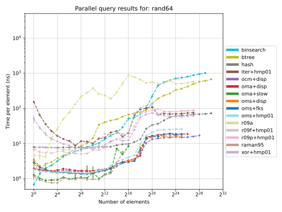
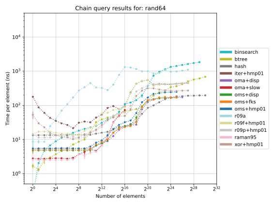
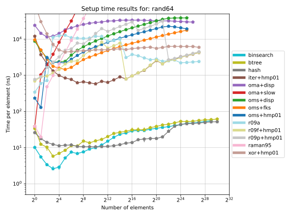
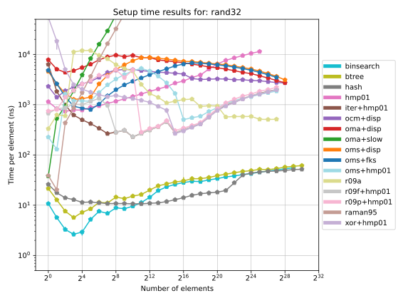

This is an experiment in implementing various _deterministic_ **static**
dictionaries, to see how terrible the performance is compared to the usual
randomized dictionaries. (The asymptotic runtime can be misleading, since the
RAM model does not perfectly model caches, and because constants may differ
significantly.)

TLDR: construction times per element are currently worse by a factor 10-100,
query times can be better or worse depending on what algorithm you compare with.

#### Simple approaches:

- Binary search on sorted array: O(sort(n)) construction, O(log n) query
- BTreeMap: O(sort(n)) construction, O(log n) query

#### Reference (randomized) approaches:

- HashMap: O(n) expected construction, O(1) expected query

#### Deterministic dictionaries

Papers of note (results are often described in multiple papers by the same
authors):

- Fredman, Komlós, Szemerédi 1984, "Storing a sparse table with O(1) worst case
  access time."
- Raman 1995, "Improved data structures for predecessor queries in integer sets"
- Alon, Naor 1994, "Derandomization, witnesses for Boolean matrix multiplication
  and construction of perfect hash functions",
- Hagerup, Miltersen, Pagh 2001, "Deterministic Dictionaries"
- Ružić 2009 papers: A="Constructing Efficient Dictionaries in Close to Sorting
  Time", B="Making Deterministic Signatures Quickly".

The papers describing a deterministic dictionary usually glue together one or
more hash functions, with some chain or tree-like construction fashion. The hash
functions are usually fast to evaluate. There are three approximate categories:

- Universe reduction: `[2^b or n^{O(1)}] -> [n^c]` for `c ≥ 2`, with no
  collisions. Best possible space cost is `Θ(log n)` bits.

  - Ružić2009B: approximate square root reduction in domain size, with `c > 2`,
    using `O(log n)` bits and `O(n polylog n)` time. (Exact performance depends
    on method used to estimate inversions (fast 2-approx gets `c > 3.42`, exact
    calculation gets `c = 2`.)
  - HMP01: `[2^b] -> [n^c]` where `c` depends on the best high relative distance
    linear codes from `b` to `O(b)` bits and is at least `2`, but `3-6` in
    practice. Uses `O(\log n)` bits of space and `O(n polylog n)` construction
    time.
  - Raman95: `[2^b] -> [O(n^2)]` with `O(b)` bits of space, but takes `O(n^2 b)`
    time. Uses the odd-multiply-shift hash family. There is a (as yet
    unpublished) algorithm using `O(n b log n)` time. Using an
    odd-multiply-add-shift or odd-carryless-multiply-shift family reduces the
    output space usage slightly and is also doable in `O(n b log n)` time.
  - Derandomized tabulation hashing: `[n^{2k}]->[n^2]` using `O(n k polylog n)`
    space and construction time, but can be fast to evaluate when `n` is small.
  - (Not implemented) AlonN94, `O(b)` space, `O(n b (log n)^3)` time.

- Compact perfect hash: `[n^O(1)] -> [O(n)]`, with no collisions. Best possible
  space cost is `Θ(n)` bits.

  - HMP01: `O(n \log n)` construction time, `O(n \log n)` bits of space.

- Low-collision hash: `[n^O(1) or 2^b] -> [O(n)]`, with "not too many" keys
  mapped to the same bucket. The best possible space cost is `Θ(log n)` bits.

  - Ruzic09A: `[n^2 / O(polylog n)] -> [O(n)]` with `O(n polylog(n))` space and
    `O(sort(n) \log \log n)` construction time.
  - The `Raman95` and `AlonN94` construction parameters can be smoothly adjusted
    to trade output space for collisions; the time/space are the same.

The best high level designs appear to use universe reduction down to `[n^O(1)]`,
and then apply (a constant number of times, possibly just once) an
`[O(n^2)] -> [O(n)]` hash. The latter stage uses a low-collision hash followed
by:

- Using leaf hashes with range `O(b^2)` for size `b` leaves: FKS84, (partially)
  Ružić09A
- A displacement table: HMP01

No deterministic construction is known for which (like the randomized Czech,
Havas, Majewski 1992 or Cuckoo perfect hash constructions) only one round of
queries outside of the L1 cache need be made. (HMP01 uses two displacement
tables; FKS84-like designs have leaf tables.)

### Benefits of determinism

Some of these are attainable with randomized constructions.

- reproducibility
- guaranteed correctness
- no need for a random source or seed
- no "private" information: will work efficiently even if there are white box
  adversaries
- uses no cryptographic assumptions

### Limitations of benchmarks:

- Memory and CPU are shared resources in practice, and dictionaries may behave
  very differently on idle and busy systems.
- Code has been structured for latency, not throughput.
- Although code is measured on pseudorandom input, it is optimized for
  worst-case behavior. Pseudorandom inputs are already well distributed and
  algorithms that take advantage of that may perform better. For a fair
  comparison, one would need to identify what input families exactly are hard
  for each dictionary, and measure each dictionary against its worst case
  inputs.
- The simple/reference approaches are what the standard library provides, and
  have not been optimized for this specific task. Other data structures with
  fast queries and more specialized hash table designs may perform _much_
  better.
- Many optimizations are still possible. Dictionaries have not yet been
  specialized to use optimal type widths for each input size, nor have
  hyperparameters been optimized.
- The benchmarks do not show the memory usage of the dictionaries; the exact
  amount of overhead may vary.
- Query performance is measured after warming the cache (querying ever key once,
  so it is stored in the CPU caches if possible). Worst-case query time is not
  measured (but can easily be calculated from the number of loads from main
  memory that a hash could use.).

### Related data structure projects:

- https://github.com/beling/bsuccinct-rs
- https://github.com/rust-phf/rust-phf

### License:

MPLv2

### Results:

See the source code for details on the implementations being compared and how
they deviate from the ideal constructions in the papers.

- rand64: pseudorandom u64 keys in 0..u64::MAX

- rand32: pseudorandom u64 keys in 0..u32::MAX (and parameter `u_bits = 32`)

- setup: Time to construct the dictionary

- parq: Query every element _in_ the dictionary, with no dependency between
  successive queries

- chainq: Query every element _in_ the dictionary, with a logical dependency
  between successive dictionary queries

To generate all plots, use `figures.py`.

- chainq vs parq performance: even without explicitly batch-optimizing the code,
  much of the query latency is hidden (by the compiler and CPU) for simple hash
  functions.

 

- Universe reduction performance depends strongly on the input width, with
  universe reduction stages becoming entirely unnecessary if the input space is
  small enough:

 

In general, dictionaries with faster query times take longer to construct; which
to use depends on the tasks the dictionary is used for.

- Fastest queries, slowest construction: Designs using multiply-shift hashing
- Medium query and construction time: Ružić2009B universe reduction + HMP01
  perfect hash
- Fastest construction (for large inputs), slowest queries: Ružić2009B universe
  reduction + Ružić2009A perfect hash

### Notes:

- Compiling with `RUSTFLAGS=-Ctarget-cpu=native` is recommended.
- Hagerup et al:
  - The fancy bit packing/word parallelism tricks in the paper can be replaced
    by SIMD in practice (although for best performance one would need to
    specialize for each data width)
  - Similarly, we now have `clmul` and `pext` and can avoid integer
    multiplication tricks.
  - The number of output bits for deterministic double displacement hashing can
    be reduced slightly. (See `analysis.pdf`; this speeds up construction by
    ~30% at 1e6 elements.)
  - Significant (≥ 20%) construction and query speedups would be possible if one
    could use error correcting codes with optimal relative distance and fast
    encoding.
- Ružić 2009A:
  - Algorithm 1 has light typos: `φ(q_start)` should be `φ(x_{q_start})`, and
    `(k+2)2^j < φ(x_q)` should be `(k+2)2^j ≤ φ(x_q)`
  - Algorithm 1 in the paper does not record the trailing leaf set
- Multiply-shift hashing (Raman95):
  - Directly using the multiply-shift hash with an `O(n^2)` output size table is
    very fast for small input sizes, but the large table size renders the design
    impractical. However, if one has many small hash tables, the size overhead
    may not be a problem, because the hash tables resulting from this design are
    sparse and one might be able to place multiple such tables overlapping in a
    memory region, using different base offsets for the tables.
