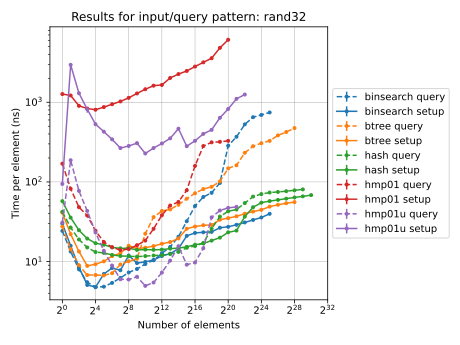

This is an experiment in implementing various _deterministic_ **static**
dictionaries, to see how terrible the performance is compared to the usual
randomized dictionaries. (The asymptotic runtime can be misleading, since the
RAM model does not perfectly model caches, and because constants may differ
significantly.)

TLDR: construction times per element are currently worse by a factor 10-100,
query times can be better or worse depending on what algorithm you compare with.

#### Deterministic dictionaries

- Hagerup, Miltersen, Pagh 2001, "Deterministic Dictionaries": implemented (with
  mild optimizations, for specific parameters); construction time O(n log n),
  query time O(1)
- Ružić 2009 papers: todo

#### Simple approaches:

- Binary search on sorted array: O(sort(n)) construction, O(log n) query
- BTreeMap: O(sort(n)) construction, O(log n) query

#### Reference (randomized) approaches:

- HashMap: O(n) expected construction, O(1) expected query

### Benefits of determinism

Some of these are attainable with randomized constructions.

- reproducibility
- guaranteed correctness
- no need for a random source or seed
- no "private" information: will work efficiently even if there are white box adversaries
- uses no cryptographic assumptions

### Limitations of benchmarks:

- Memory and CPU are shared resources in practice, and dictionaries may behave
  very differently on idle and busy systems.
- Code has been structured for latency, not throughput.
- Although code is measured on pseudorandom input, it is optimized for
  worst-case behavior.
- Dictionaries have not been specialized to use optimal type widths for each
  input size.

### Related data structures:

- https://github.com/beling/bsuccinct-rs
- https://github.com/rust-phf/rust-phf

### License:

MPLv2

### Results:

### Notes:

- Compiling with `RUSTFLAGS=-Ctarget-cpu=native` is recommended.
- Hagerup et al:
  - The fancy bit packing/word parallelism tricks in the paper can be replaced
    by SIMD in practice (although for best performance one would need to
    specialize for each data width)
  - Similarly, we now have `clmul` and `pext` and can avoid integer
    multiplication tricks.
  - The number of output bits for deterministic double displacement hashing can
    be reduced slightly. (See `analysis.pdf`; this speeds up construction by
    ~30% at 1e6 elements.)
  - Significant (≥ 20%) construction and query speedups would be possible if one
    could use error correcting codes with optimal relative distance and fast
    encoding.
